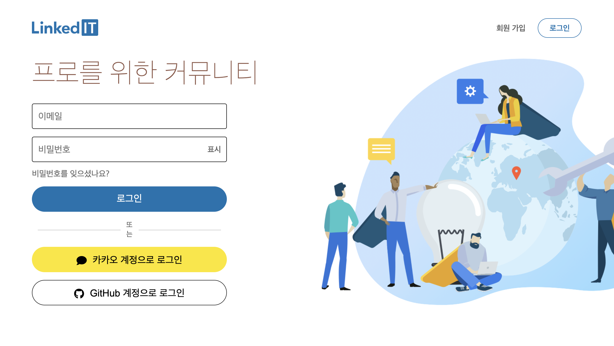

# LinkedIT 링크드잇

- 비즈니스 전문 소셜 미디어 '[링크드인(LinkedIn)](https://www.linkedin.com/)'을 클론 코딩한 프로젝트입니다.
- 기간: 2021.10.25 ~ 2021.11.05 (12일)
- 인원: 프론트엔드 5명, 백엔드 2명
- [🎥 프로젝트 Demo 영상 보기](https://youtu.be/0SEaP6M2wdg)

 

## 🤝 Back-end Repository

https://github.com/wecode-bootcamp-korea/fullstack2-2nd-Linked-IT-backend

 

## 🛠 기술

#### `Front-end`

  
  
  
  

React, React-Hooks, React-Router, Styled-Components

#### `Back-end`

  
  
  
  
  
  

Node.js, Express, MySQL, Prisma, Postman, Jest, JWT, Bcrypt

 

## 📌 구현 기능 개요

- 사이트 전체 범위에 대한 검색 기능, 검색 결과 페이지 및 TopNav & Button 컴포넌트 구현

 

## 📑 구현 기능 상세

### 1. 공통 구현 사항

- TopNav
  - 검색 창 레이아웃 및 검색 결과 표시 기능을 Dropdown 효과로 구현
  - 아이콘을 클릭하면, 각 페이지의 경로로 이동하는 기능을 NavLink 컴포넌트를 활용하여 구현
- Button
  - 주어진 Props에 따라 버튼의 색상, 아이콘 포함 여부 및 아이콘 위치 변경 등을 설정할 수 있도록 가변적으로 설계

### 2. MainSearch(검색 결과) 페이지

- User가 입력한 검색어와 연관된 인맥 및 회사의 결과를 각각 3개씩 보여주는 기능 구현
- 인맥 및 회사의 검색 결과가 각각 3개 이상인 경우에는 '결과 모두 보기' 버튼을 조건부 렌더링으로 구현
- '결과 모두 보기' 버튼 클릭 시, 해당 결과에 대한 Pagination 구현

 

### ※ References

---

- 본 프로젝트는 팀원들의 학습을 목적으로 [링크드인(LinkedIn)](https://www.linkedin.com/)을 참고하여 만들었습니다. 이 코드를 활용하여 상업적인 이득을 취하거나 무단으로 배포할 경우에는 법적으로 문제 될 수 있습니다.
- 본 프로젝트에서 사용하고 있는 각종 이미지들은 [Unsplash](https://unsplash.com/) 등에서 무료로 배포 중인 이미지들로 대체하였습니다.
